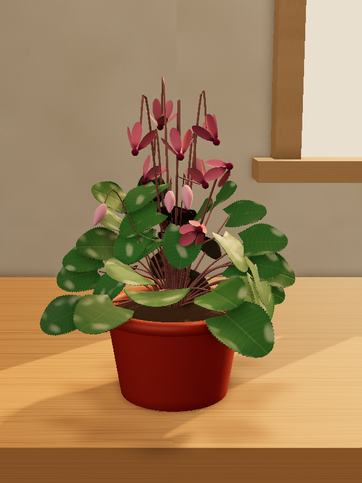
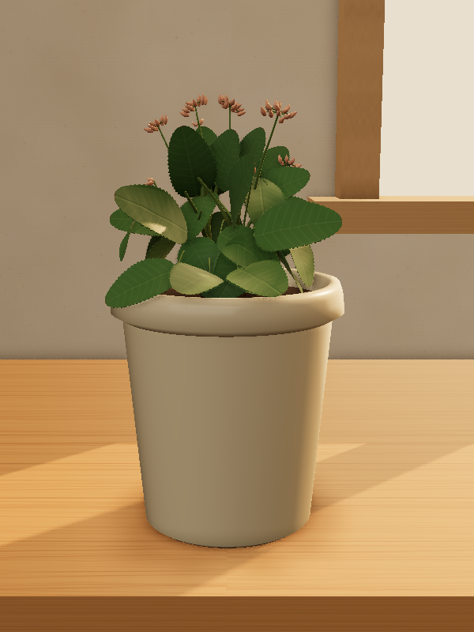

# Photo-faithful reconstruction

Goal: a stylized 3D plant the owner recognises as **their** plant (same silhouette, fullness, flowers), not a generic plant of the species.

## Why the render did not match the photo

1. **Mock mode.** With `USE_MOCK=true` every photo returns the hand-authored `observedMonstera` in about 0.6 s, whatever was uploaded.
2. **Live mode could not run.** `temperature: 0` is rejected by current models, and the full vision schema is too large for strict structured outputs.
3. **No place for flowers.** The vision contract had no field for flowers, buds or fruits, so they could not reach the renderer.
4. **Density did not add foliage.** The render drew `leaf.countNow` blades. Claude undercounts bushy plants, and `crownDensity` only changed the spread.
5. **Generic placement.** At most 32 observed blades kept their photo positions. Every other leaf followed a golden-angle pattern around generated stems.
6. **Roots by default.** The main viewer opened on a cut-away pot with roots.

## Pipeline now

```
photo -> visual inventory (Claude, high effort) -> IndividualPlantProfile + species.flowering
      -> species presets fill what the photo cannot show -> stylized 3D (leaves, stems, flowers)
```

- `server/src/claude.ts`: the JSON Schema goes in the prompt and zod validates the answer (one retry with the error, then 502). No sampling parameters. The call streams.
- `server/src/prompts.ts`: the model inventories before it describes. It counts leaves, flowers, buds, fruits and stems, then gives silhouette and fullness, then structure, then blooms, then species flower structure. Visible organs are never dropped, and none are invented.
- `shared/morphology.ts` (**IndividualPlantProfile**, this plant) now carries:
  - `occupancy`: an 8×8 foliage silhouette.
  - `stems`: the observed leafy stems.
  - `blooms`: counts, sampled colours, flower size, placement, stalk length, and up to 24 flower/bud/fruit landmarks with position, depth layer, facing and floret count.
  - Extended `crownShape` values.
- `shared/species-profile.ts` (**SpeciesProfile**, the species) now carries `flowering`: form, petals, petal shape, inflorescence, typical colours and fruit, taken from `species.flowering` returned by Claude. Rosettes such as cyclamen or African violet get their own preset instead of Monstera's holes.

All new fields are optional in `PlantProfile` (saved plants still load) and required in `VisionPlantProfile`.

## Renderer

- **Density floor** (`densityLeafFloor`). The leaf count is raised to what the photographed foliage area needs to look as opaque as its observed density. Legacy profiles keep their own count.
- **Silhouette fill** (`sampleFoliage`, `canopyNormal`). Leaves that are not individually observed are placed in occupied cells of the photo silhouette. Each lies tangent to the canopy dome with its top face out and follows the observed leaf angle. Observed blades keep their photo positions and show their top face to the camera.
- **Observed stems.** Leafy stems end where the photo shows their leaves end. Flower stalks belong to the blooms.
- **Frame at the pot rim.** A photo shows the plant starting at the rim, not the hidden soil.
- **Flower generator.**
  - `bloomLayout.ts`: every counted flower, bud and fruit is drawn. Landmarks sit where the photo puts them. Extra heads are spread where the species carries them. Clusters open into domes or spikes of florets, with peduncles and pedicels.
  - `Flowers.tsx`: instanced petals fanned at the opening angle of the species' flower form (11 forms), blending into the photographed centre colour. Also buds, fruits and spadices. Heads nod under drought.
- **Roots are opt-in.** The main view shows an intact pot. "Show roots (cut-away pot)" in the plant screen opens it.

## Visual pass (same geometry, better rendering)

The layout is untouched: the same organs sit in the same places. What changed is how they are drawn.

- **Stems** (`StemGeometry.ts`): each stem is a spline that tapers progressively. Main stems have a flared base. The section is slightly oval and turns along the stem, with a gentle low-frequency swell. Vertex colours make main stems woody and darker at the base and petioles fresher. A fibre detail map finishes the surface.
- **Leaves** (`leafBlade.ts`, `leafSurface.ts`, `Plant.tsx`):
  - **Shape:** the blade arches, the margins form a shallow gutter, and a midrib groove and light quilting run between the veins.
  - **Material:** a physical material with a waxy clearcoat on glossy leaves and a faint sheen on matte ones. A shared vein normal map adds relief.
  - **Light:** thin-tissue shading lets backlit blades glow (`shading.ts`).
  - **Variation:** four blade variants and a per-leaf tint, so no two neighbouring leaves are identical.
- **Flowers** (`Flowers.tsx`): smooth 18×12 petals with a narrow claw, rounded or pointed tip, cup and curl per form. The velvety material has sheen and backlit translucency, fine veins, a paler margin and back, and blends into the photographed centre colour. Buds are smoother.
- **Scene** (`Interior.tsx`, replaces the old flat lighting file):
  - an oak table against a limewashed wall;
  - a wood-framed window to the right of the plant;
  - late-afternoon sun through that window, with soft PCSS shadows;
  - warm bounce fill and environment reflections, contact shadow and half-resolution GTAO;
  - ACES Filmic tone mapping and sRGB output;
  - a lower camera.
- Everything is procedural, with no downloads. The cyclamen view draws about 86 calls, AO pre-pass included.

## Run it live

```sh
# server/.env: ANTHROPIC_API_KEY=..., USE_MOCK=false, ANTHROPIC_MODEL=claude-opus-5-5 (or claude-sonnet-5)
npm run dev -w server                       # or PORT=8791 to run next to another checkout
API_PORT=8791 npm run dev -w web -- --port 5191
```

One analysis took 36 to 55 s with Opus 5.5 at high effort, on the first validation attempt each time. The sample plants **Florist's cyclamen** and **Flaming Katy** in Explore (and in the fidelity lab as `?profile=cyclamen|kalanchoe`) are real live scans of the photos below.

## Verify

```sh
npm run typecheck && npm run build
node --import tsx docs/fidelity/verify.ts
node --import tsx docs/photo-reconstruction/verify.ts
USE_MOCK=true PORT=8792 npx tsx server/src/index.ts &   # from server/
VERIFY_API=http://localhost:8792 node --import tsx docs/individual-morphology/verify.ts
```

`photo-reconstruction/verify.ts` checks that:
- counted flowers, buds and fruits are drawn exactly, never invented;
- petals per flower follow the species;
- blooms are deterministic;
- the density floor applies;
- fill leaves stay inside the photographed foliage;
- blades stay continuous across a leaf birth.

## Evidence

| Scan (default camera) | Source photo |
| --- | --- |
|  | [Pot cyclamen 048](https://commons.wikimedia.org/wiki/File:Pot_cyclamen_048.JPG), Penarc, CC BY 3.0 |
|  | [Flaming Katy in a ceramic pot](https://commons.wikimedia.org/wiki/File:Flaming_Katy_in_a_ceramic_pot.jpg), Slyronit, CC BY-SA 4.0 |

The photos are not in the repo.

## Limits

- The occupancy grid is coarse (8×8) and Claude's estimate. Hidden depth and the back of the plant are inferred.
- Flowers use 11 stylized forms, not per-species petal outlines. Pot shape (for example a bellied jar) is not modelled, only proportions and colour.
- Mock mode still returns the same hand-authored monstera for any photo. Only live mode reflects the uploaded plant.
